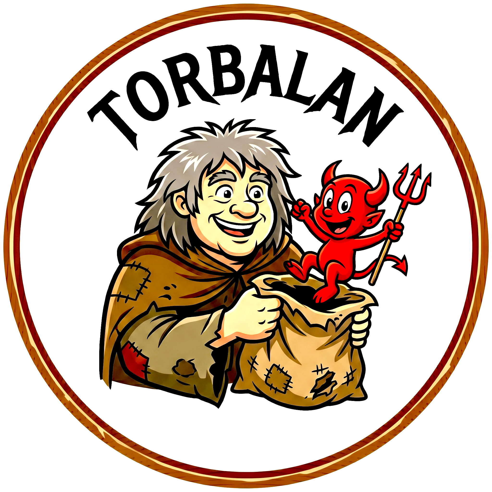

# Torbalan



Torbalan is a desktop system administration tool for FreeBSD. It provides a native GUI for authenticating with PAM and then inspecting or managing core system information from a single window.

## What it does

- Authenticates users through the system `login` PAM service
- Displays `vfs.*` kernel parameters from `sysctl`
- Lists system services and lets you start, stop, enable, or disable them
- Lists installed packages from the FreeBSD `pkg` database

The current UI is built around a bold, high-contrast Slint interface with a login screen, a left-hand navigation sidebar, and dedicated pages for:

- **Sysctl**: kernel parameter browsing
- **Services**: service status and control actions
- **Packages**: installed package inventory

## Stack

- **Rust** for the application logic
- **Slint** for the desktop UI
- **PAM** for authentication
- FreeBSD system tools such as `sysctl`, `service`, `sysrc`, and `pkg`

## Project layout

| Path | Purpose |
| --- | --- |
| `src/main.rs` | Application startup, UI wiring, async page loading |
| `src/auth.rs` | PAM-based authentication |
| `src/sysctl.rs` | `sysctl` discovery and value lookup |
| `src/service.rs` | Service listing and management |
| `src/pkg.rs` | Installed package listing |
| `ui/torbalan.slint` | Slint UI definition |
| `ui/imgs/torbalan.png` | Project logo |

## Running Torbalan

Torbalan targets FreeBSD and expects the system administration tools it wraps to be available on the host.

```bash
cargo run
```

## Notes

- The application currently loads up to 100 entries per page.
- The sysctl view is currently focused on keys containing `vfs.`.
- Service actions are executed through the underlying FreeBSD service tooling, so behavior depends on the host system state and permissions.
